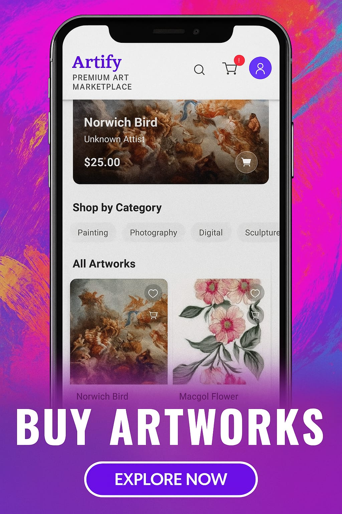

# 🖼️ Artify - Artwork Selling and Auction Mobile App

**Artify** is a full-stack mobile application built using **React Native** for the frontend and **Spring Boot** for the backend. It allows users to browse, sell, and bid on artworks through a secure and interactive platform.

---

## 📱 Mobile App (Frontend)

### Technologies Used:
- **React Native** (with Expo)
- **React Navigation**
- **Axios** for API communication
- **React Native Paper / Tailwind / Styled Components** for UI
- **Stripe / PayPal** integration for payment (if applicable)

### Key Features:
- 🔍 Browse all available artworks
- 🖼️ View detailed artwork pages
- 💰 Place bids on auctioned artworks
- 💳 Pay for bids through secure payment gateways
- 🛒 Add artworks to a cart (for direct purchases)
- 👤 User authentication (login/signup)
- 📦 View your purchase and bidding history
- ⏰ See live auction countdowns and real-time bid updates

---

## 📸 App Screenshots

### 🏠 Let's buy, sell, and auction your artworks
<p align="center">
  
</p>


---

## ⚙️ Backend (Spring Boot)

### Technologies Used:
- **Spring Boot**
- **Spring Data JPA**
- **MySQL** 
- **Spring Security** (JWT-based authentication)
- **RESTful API Design**
- **Cloudinary / S3** (for image uploads)

### Key Modules:
- 🔐 Authentication & Authorization
- 🎨 Artworks Management
- 🧑‍🎨 User & Seller Profiles
- 🛒 Cart & Checkout APIs
- 💸 Auction Bidding Logic
- 📊 Admin dashboard (optional for analytics)
- 🖼️ Image handling (upload/display)
- 📨 Email notifications for bid confirmations or sales

---

## 🚀 Getting Started

### Prerequisites
- Node.js & npm
- Expo CLI
- Android Studio / Xcode (for emulator)
- Java 17+
- Maven
- MySQL Server

---

### 🔧 How to Run (Frontend)

```bash
cd mobile-app
npm install
npx expo start
